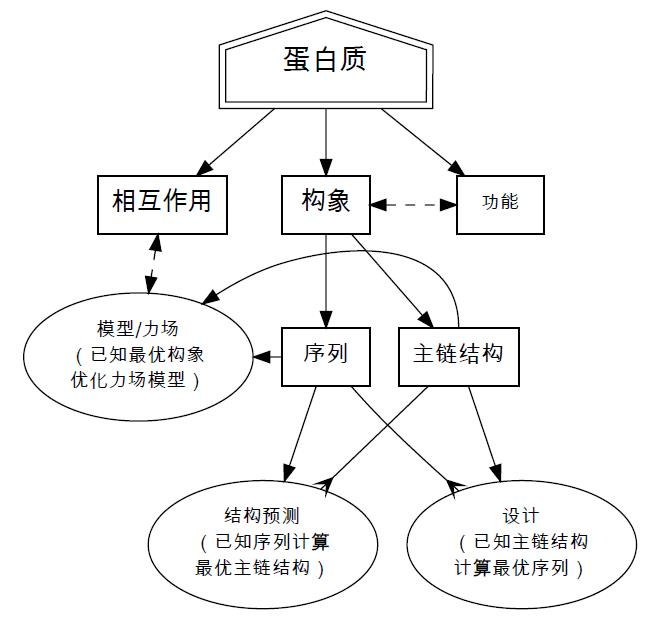

# 格子世界中的蛋白模型

人间不值得。蛋白质世界中的很多基本概念和理论，其本质是简单的，但在处理实际问题时，一方面数据量大，计算成本高，一方面体系过于复杂，往往不利于理解。我比较笨，希望在一个尽可能简单的体系里，把目前常见的蛋白质相关的理论和算法重新学习一遍。

## 蛋白质折叠

作为生命体最重要的组成物质之一，蛋白质分子如何在分子尺度正确的折叠并行使功能，直接关系到几乎所有生命运行的重要过程，诸如：遗传信息传递、信号和物质传递、酶催化反应、新陈代谢调节，以及机械能化学能转化等；同时它的错误折叠或沉聚，会导致多种重要的疾病，如阿兹海默症、疯牛病、可传播性海绵状脑病、肌萎缩性脊髓侧索硬化症，还有帕金森氏症等。蛋白质分子是一条由20 种可能的氨基酸单体聚合而成的高分子链，C. B. Anfinsen 在十九世纪六十年代的实验工作发现，在高温或者改变溶剂性质的情况下变性（解折叠）的蛋白质分子可以在不借助任何其他物质的帮助下可逆的折叠回到自然状态（native-state）。这暗示我们，蛋白质分子的三维结构信息完全可以由一维序列来确定，而自然状态所对应的，就是自由能最低的结构。由于这个发现Anfinsen 在1972 年被授予诺贝尔化学奖。近十几年，随着计算机技术的发展，计算机模拟技术成为研究蛋白质折叠的重要工具，各种模型不断涌现，精度不断提高，对折叠机理的认识也不断深入。

科技部印发的《蛋白质研究国家重大科学研究计划“十二五”专项规划》中指出，项目的主要任务之一就是研究蛋白质研究的新技术、新方法，其中包括：蛋白质结构、动力学的计算生物学研究；发展与蛋白质三维结构预测、蛋白质复合物结构预测、蛋白质动力学性质及反应过程模拟方法的研究。每两年举办一次的CASP 竞赛（Critical Assessment of Techniques for Protein Structure Prediction）就是为了评估人们对蛋白质结构的预测能力。最近的一届CASP比赛中alphafold2一骑绝尘，虽然不说就此解决了蛋白折叠的问题，但是结果远超其它参赛者，已经达到了接近实验解析的水平。

蛋白质的设计已经成为热点，随着预测精度的不断提高，相信设计的准确率也会随之大大提升。目前已经有很多公司和科研机构在投入研究，值得关注。

而模拟的两大核心议题就是“模型”和”采样“。

## HP模型

在格子世界里模型变得非常简单，却很大程度上把握住了物理本质。我希望能够用一系列的文章把这些年对这个模型的研究复现一下，同时把这个格子世界当作一个自洽的体系，在里面展示一些真实世界里蛋白质研究常用算法和应用（比如蛋白设计、对接等），还有经典的计算机模拟技术，也算是对统计物理、生物信息学等领域的入门教程。

我打算先从二维格子开始，展示一个“蛋白质”的简单——甚至可能是最简单的模型HP模型。这个模型诞生已经快30年，很多研究者试图利用这个模型研究蛋白质折叠这个分子生物学中可能是最重要的问题。它无法展现真实蛋白分子的很多复杂细节，但人们可以把模型的性质研究清楚，从而一定程度上揭示蛋白质折叠的物理本质。

## 计算机模拟

格子模型作为一个异常简单的模型，在“蛋白”序列较短（<20）时，所有可能构象是可以通过穷举得到的，而对于较长的链（~100），也可以利用分子模拟的技术进行重要性采样，得到其重要的热力学性质。这样，就可以建立一个类似于PDB的数据库，在后面可以在这个数据库上展示可以在真实蛋白世界中使用的计算工具。

## 共进化和HIP模型

序列相近的序列可能具有同样的结构，这些同源序列的共进化信息提取是近来非常重要进展，但可以看出，由于没有特异性的两体相互作用，HP模型中并不存在共进化的性质。为了能够让模型能够捕捉这个物理性质，我们在HP模型中引入了一个新的输水类型I，定义只有在H和I之间才存在相互作用，希望可以得到一个研究共进化的最简模型。我们也会在一些场景中分析这个模型的物理性质。

