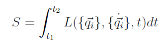
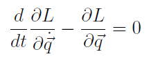
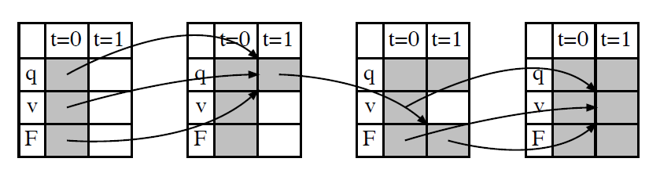
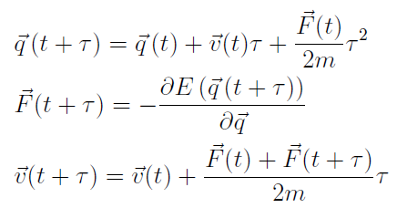

## 采样（方法会过时，思想永流传）

首先要讨论的一个问题是我们为什么需要研究采样方法。当我们说给定了一个体系的时候，指的是给定了一个以构象为函数的汉密顿量，也就是当一个体系的每个自由度的坐标确定，体系的能量可以直接算出。而利用统计物理的工具，就可以建立微观物理量到宏观热力学项的联系，这要求我们计算体系在指定系综下的配分函数。具体的公式在这里不展开讨论，总之我们需要做的是对体系的全构象空间进行积分。这个要求在一般情况，尤其是自由度较多时很难做到。好在，我们可以通过重要性采样来得到这个积分相对准确的估计，采样方法可以理解为为了求得所关心物理量在不同约束下概率分布，近而估算平均值日而使用的数学方法。当然后面要介绍的分子动力学方法、以及蒙特卡洛方法除了可以计算平均值外，还可以用于模拟分子运动的合理轨迹，加深人们对分子机制的理解。

### 经典力学

最常用的分子模拟框架为分子动力学，原子运动的法则由最小作用量原理给出（后面将会看到此表述和牛顿第二定律等价，并更具有一般性）。

运动的轨迹使S 取极值（一般为极小值）。L 被称为体系的拉格朗日函数，这里直接给出其形式

等式右边第一项为动能，一般用K 表示，它只与速度的大小有关，不随方向变化而变化，这反应了惯性系各向同性的性质；第二项E 为体系的势能函数，只与位置相关。在朗道《力学》教材第一章中，对L 的形式有更加详尽的讨论。

因为S 取极小值， 其变分为0， 即δS = 0； 且两端点坐标固定， 即δq(t1)=δq(t2)=0。由此可以得到拉格朗日方程（为方便，后面角标i 不再出现，向量表示所有粒子的坐标）

将L带入整理则得到牛顿第二定律

这里的q可以不再局限于质点的笛卡尔坐标，而可以是任意的广义坐标，又可称为体系的自由度。在大分子的模拟中，往往使用内坐标会比笛卡尔坐标有更高的采样效率，需要注意的一点是，如果在坐标变换后进行采样，采样的权重需要引入雅克比行列式进行矫正，以保证采样在相空间中分布均匀。

分子动力学模拟中，用数值方法求解给定初始状态的动力学方程，常用Velocity-Verlet算法更新原子速度和坐标

计算公式如下

实际进行分子动力学模拟时还有很多细节如控温控压，约束键长等方法和技巧，但在格子世界里位置都是离散的，我们也用不到这些，这里简单提一下。

### 蒙特卡洛

对于坐标连续且可以求导的问题，分子动力学是比较合适的工具，可以无脑运行，烧脑分析。而很多模型，尤其是高度抽象的理论模型，坐标是离散的且无法求导时（当然连续问题也可以）就需要采用蒙特卡洛模拟方法进行采样。

## 模型（aka. 力场）

前面还提到了汉密顿量，也就是给定构象的体系能量，这是问题成功与否的关键。相对来说采样方法有效率高低之分，但就算是低效的采样，也依然可以得到一些有用的结果，大不了跑久一些。而模型的选择或者说构建，是一门艺术。理论上量子力学是最精确的模型，但原子一多就算不动了，近似方案虽然能一定程度缓解，但一方面误差越来越大，一方面可应用的体系还远达不到蛋白质分子的规模。

模型

## 介绍一篇文献
