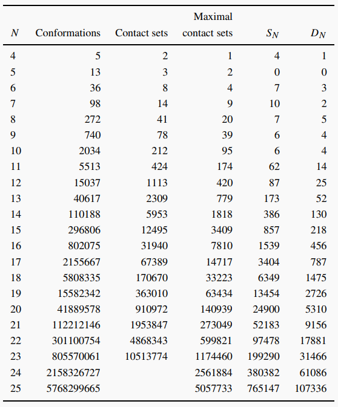
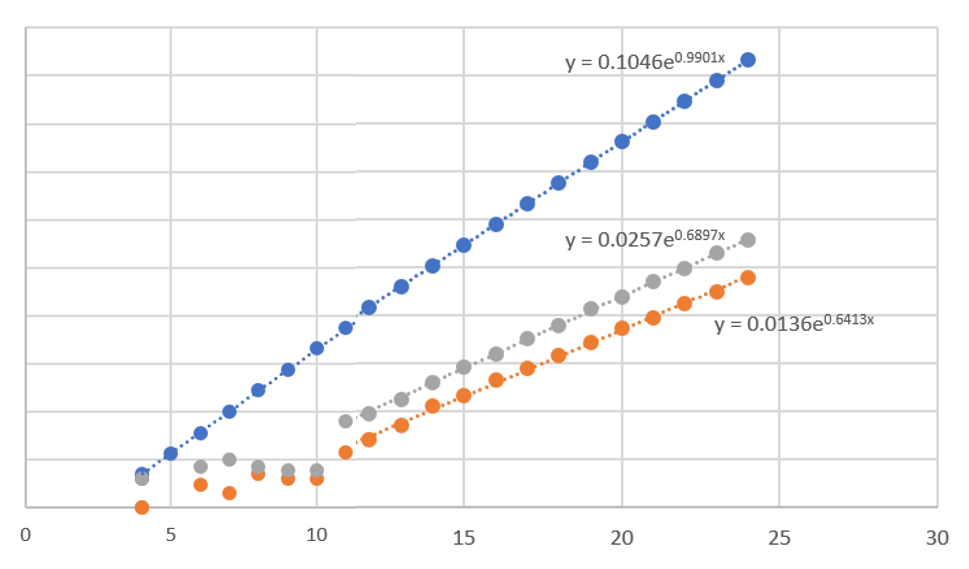

## 最朴素的采样

对于一个复杂问题，需要用计算机进行采样，而如果问题相对简单，则可以用穷举的办法。这样的一个好处是可以得到绝对正确的答案，用这个结果做基准，就可以比较不同模拟方法的性能。

对于HP模型，最近找到这样一篇文献：

Enumerating designing sequences in the HP model. Anders Irbäck and Carl Troein, Journal of Biological Physics 28, 1-15 (2002)

作者开发了一个程序可以快速穷举HP模型中可设计的序列（定义为对于这个序列，不考虑对称性，最低能级的简并度为1），这个程序效率分常之高，可以在合理时间内穷举到L=30。并且他们也很nice的在网站share了已有的结果：https://www.atp.lu.se/cbbp/software/hpdesign

这样就得到了一个HP模型的数据集，可以在上面做一些统计，测试一些算法。

作者在文章中对链长为4-24的HP模型进行了穷举，得到了构象数、接触集数、最大接触集数、可设计序列数、可设计构象数进行了统计。据此我们也可以得到一些标度关系。

由于是HP模型，可能的序列数随着链长增加为2^L的关系。对于完全自由的链，可能的构象数为4^(L-1)，如果考虑不能回退则为3^(L-1)，自避链的约束更大一些，肯定小于3，穷举的结果显示它非常接近于e，不知有无深意，还需要查查文献。可设计的序列近似也为2^L，我们可以估算出可设计的序列占全部序列空间约2%~3%，不同序列可能折叠成为同一个结构，所以可设计的结构数会小于2，模拟结果为1.8989，不知这里有没有什么理论解释。
